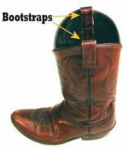
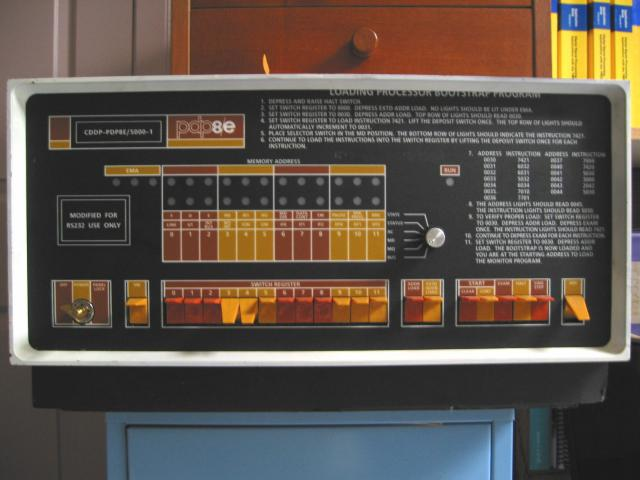

# About Angular

Udemy course: https://www.udemy.com/share/1000imAEQcdllXRQ==/

## Single Page Application

## Versions of Angular

### Angular 1, now called AngularJS

*	Uses JavaScript
*	About as easy to include as jQuery.  CDN is available.

### Angular 2 through 7

*	Uses Typescript
*   For practical purposes it requires npm from the Node.js package
    *   NPM is the "Node Package Manager"
        *   NPM can also be used to install things like jQuery.
        *   Most web developers will have it installed
        *   NPM creates the project structure
        *   When you save npm compiles the TypeScript to JavaScript and minifies it.
    *   NOde.js also runs a server, something like LiveServer does from VS Code.
*   6-month release cycle on versions.  7 isn't all that different from version 2.
    *   A couple of versions have been skipped.

## Typescript

## Bootstrap vs Bootstrap

* Bootstrap as advanced css
* Bootstrap as in Bootstraps
	* Pick yourself up by your Bootstraps
		* In IT, it generally means "a program that gets things started"

|Bootstraps on Cowboy Boots|
|:---:|
|  |

|Bootstrap flip-switches on a PDP-8|
|:--------:|
| |
|Punched Card Reader   | 
| Punched Card  |
