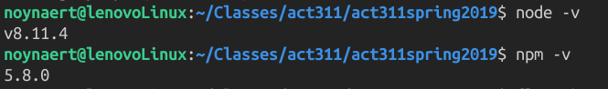

# Getting started with Nodejs and JavaScript

## Installing

* For Windows and Mac: https://nodejs.org/en/download/
* For Ubuntu, Mint, and most .deb distributions use 

```bash
    sudo apt update
    sudo apt install nodejs npm
```

### Confirm Installation

Use the CLI (Command Line Interface) aka terminal

```bash
    node -v
    npm -v
```
Here is what it looks like on my system at home


## IDE's

* WebStorm 
  * By JetBrains, the same company that produces IntelliJ that we use in CSC 254.
  * Expensive, but if you register an account with your @missouriwestern.edu user name it is free with your account
  * WebStorm is similar to PHPStorm.  
    * WebStorm focuses on JavaScript platforms
    * PHP storm focuses on PHP

* VS Code
  * 