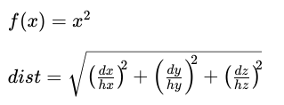
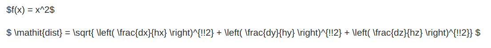

# Markdown

## About Markdown

Markdown is a lightweight markup language.  It pops up in different places.  It is the formatting language used by Reddit.  It is also used for a lot of documentation projects.  Github is one place that uses it heavily.

There are different extensions to basic markdown.  Github has its own extensions.

## HTML

* Markdown is meant to be simplified HTML
* Markdown is converted to HTML

## For VS Code

* Tons of extensions.  I use "Markdown All in One" by Yu Zhang
* Either
  * Look for it in the market or
  * Ctrl P to open the command window with Ctrl-P and paste the following:

      ext install yzhang.markdown-all-in-one

  * Remember to reload
  * There should be a dual-pane icon in the upper right corner to turn on preview.

## Cheatsheets!

* Pretty good third-party cheatsheet https://github.com/adam-p/markdown-here/wiki/Markdown-Cheatsheet
* [The official Github .pdf file](https://guides.github.com/pdfs/markdown-cheatsheet-online.pdf)

## HTML and LaTeX in markdown

  
You can do inline HTML and Latex (mainly for equations), but it will typically set off lint programs Some platforms may not support it.  Generally it is a bad idea to use html and LaTeX unless you know how it will look in the environments it will be seen in.

Here is an example of some html.  It does not render in github, but it looks OK in VS Preview.  The moral is that you should avoid using raw html or LaTex if you can.

\Hello\
\

\$f(x) = x^2$

\$
\mathit{dist} = 
\sqrt{ \left( \frac{dx}{hx} \right)^{\!\!2} +  \left( \frac{dy}{hy} \right)^{\!\!2} +  \left( \frac{dz}{hz} \right)^{\!\!2}}
\$

|As appears in vscode preview|As it appears on github.|
|:---:|:---:|
|HTML  |HTML  |
|Latex  |Latex  |

Hello

$f(x) = x^2$

$
\mathit{dist} = 
\sqrt{ \left( \frac{dx}{hx} \right)^{\!\!2} +  \left( \frac{dy}{hy} \right)^{\!\!2} +  \left( \frac{dz}{hz} \right)^{\!\!2}}
$

## :star: Emogi :star:

Emoji cheatsheet: https://www.webfx.com/tools/emoji-cheat-sheet/

This is a lot like HTML and LaTeX, except in this case github supports emoji, but preview does not.  So be careful.